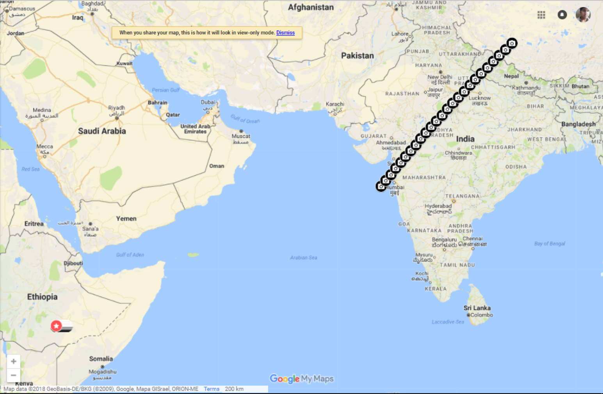
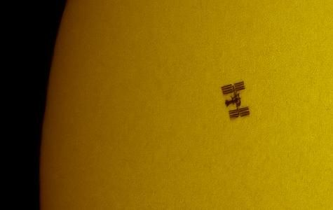
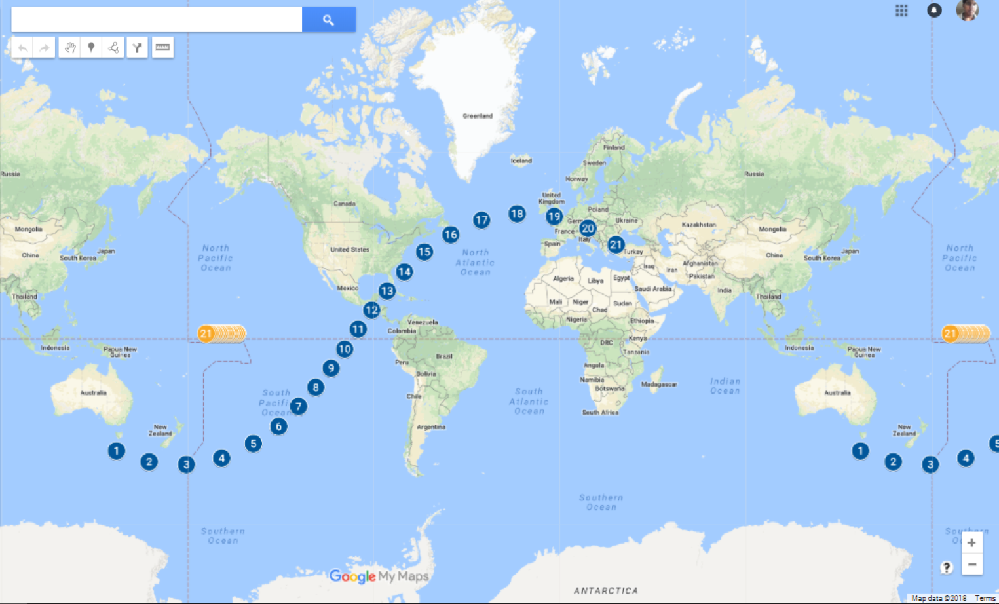

# Sun-and-Satellite-transit-predict
This code accurately predicts the time and location(lat|lon) of finding a satellite exactly between the viewer and the sun.  We can find satellite's attitude(orientation) from its  silhouette formed behind the bright sun.

(checkout how u can rescue a failing satellite with this code: https://kalyan0510.github.io/posts/satrescue.html)

Few terms:
TLE (Two Line Elements): set of parameters which defines projected path/trajectory of a freely orbiting body. TLEs are short lived in case of LEO satellites.  
More explanation in https://github.com/kalyan0510/Sun-and-Satellite-transit-predict/blob/master/Solar%20Transit%20Predection%20for%20Orientation%20detection.pptx

Live updated TLEs of International Space station [Zarya] are maintained here: https://live.ariss.org/iss.txt

## Usage
1. Update the two line element in pathfinder.m
2. run SatelliteTransitDataGenerator.m to generate the transit path.
3. satellite_shadow_data.csv will contain time, latitude & longitude
4. This file can be directly uploaded at https://www.google.com/maps to generate path 

So if one sits at that spot and looks at the sun at that time, they can see the orbiting satellite's silhouette. And ofcourse  good lens are needed.  

For example:  

Also sun and satellites direct overhead location and time is calculated and stored in satellite_sun_data.csv & satellite_sat_data.csv resp., if plotted, it looks like,  

